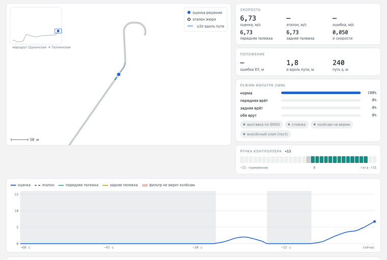

# Резервная одометрия беспилотного трамвая

Решение кейса «Резервная одометрия по модели» (хакатон Московского транспорта). ROS 2 Humble-нода в реальном времени
оценивает продольную скорость и положение трамвая **только по трём топикам** — скоростям передней и задней тележек и
положению ручки контроллера — и публикует `/result/velocity` и `/result/position`. GNSS не обязателен: если в первые
секунды есть RTK, он используется только для начальной выставки (окно 20 с) — положение сразу в системе карты;
если GNSS нет (нода ждёт 5 с), решение работает в режиме относительной одометрии (`x` — пройденный путь, `y = z = 0`),
как разрешает задание.

Модель: физическая модель привода + поправка гауссовского процесса, многомодельный фильтр (IMM) по тележкам,
детектор проскальзывания обеих тележек по ускорению, карта маршрута для положения. Подробно — `docs/report.pdf`.

[](docs/demo.mp4)

Решение «едет» по записи так же, как в ROS 2: синяя точка — оценка, кольцо — эталон жюри; справа — скорости тележек,
вероятности режимов IMM и ручка контроллера; красная полоса — фильтр не верит колёсам. На анимации (50 с) по порядку:
наш тест с внесёнными резкими проскальзываниями обеих тележек, запись организаторов с остановкой при ручке в нейтрали
и конец рейса у «Таллинской». Полное видео 2,5 мин — [`docs/demo.mp4`](docs/demo.mp4).
Анимация построена по версии с улучшениями из ветки `post-deadline`.

## Состав

```
ros2_ws/                    ROS 2 Humble — это и есть решение для жюри
├── src/tram_vehicle_msgs/      сообщения VelocitySensor и DriverControllerCommand
├── src/tram_backup_odometry/   нода, оценщик, карта и откалиброванные таблицы, параметры, launch
├── README.md                   сборка, запуск, контракт, параметры
└── test_in_docker.sh           проверка судьёй жюри в Docker
solution/                   тот же оценщик без ROS: запуск на записи (.db3) одной командой
docs/
├── demo.gif / demo.mp4               анимация решения: 50 с в README и полное видео 2,5 мин
├── report.pdf                        полный отчёт: модель, формулы, проверка, графики, ограничения
├── 3_mathematical_model.pdf          математическая модель
├── 4_assumptions_and_parameters.pdf  допущения и параметры
├── 5_accuracy_and_performance.pdf    таблицы точности и быстродействие
└── 6_limitations_and_roadmap.pdf     ограничения и план развития
```

## Запуск (ROS 2 Humble)

```bash
source /opt/ros/humble/setup.bash
cd ros2_ws
colcon build --packages-select tram_vehicle_msgs tram_backup_odometry
source install/setup.bash
ros2 launch tram_backup_odometry odometry.launch.py
# в другом терминале:
ros2 bag play <папка записи>
```

Нужен только `numpy` (есть в `ros:humble-ros-base`). Если в workspace уже есть `tram_vehicle_msgs` только с
`VelocitySensor`, замените его нашим — ноде нужен ещё `DriverControllerCommand`; `VelocitySensor.msg` идентичен.

## Проверка судьёй жюри в Docker

```bash
cd ros2_ws
docker run --rm -v $PWD:/src_ws:ro -v <check-code>:/check:ro -v <запись>:/bag:ro \
    ros:humble-ros-base bash /src_ws/test_in_docker.sh 1
```

`<check-code>` — пакет судьи жюри (`hackathon_solution_checker`), `<запись>` — rosbag2 с `/localization/kinematic_state`.

## Запуск без ROS

```bash
pip install numpy pandas
python3 solution/run_offline.py <папка записи с .db3>     # → estimate_<запись>.csv
```

## Результат

Тест организаторов (запись 30618_88aea4d9, метрика судьи жюри, ничего под неё не подбиралось):

| | скорость RMSE | положение 3D RMSE |
|---|---|---|
| ROS 2, судья жюри, реальное время | 0,056 м/с | 7,20 м |
| та же метрика офлайн | 0,052 м/с | 6,84 м |

Максимум 3D-ошибки (≈ 60 м) — последние ≈ 25 с записи, где вагон уходит в тупик, которого нет в карте маршрута;
без этого участка ≈ 2 м. Проверка на отложенных рейсах, сценарии проскальзывания и ограничения — в отчёте.
